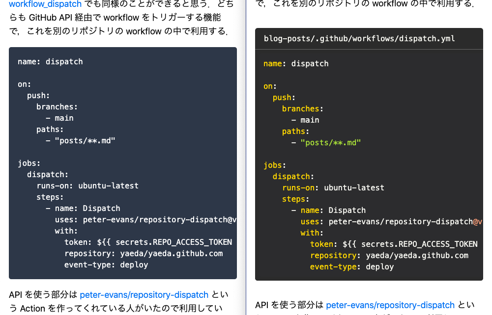

このブログで markdown のレンダリングに`dangerouslySetInnerHTML`を使っていた部分を修正するついでにコードの Syntax Highlight に対応したりタイトルを付けられるようにした．



改修に取り掛かるにあたって unified/remark/rehype/micromark などなど unified 関連を色々調べたがとりあえずまるっと全部入りの `remark-react` を使うことにした．Syntax Highlight は prism(refractor)系と highlight.js(lowlight)系があるみたいで違いがよく分からずいろいろ試して`react-syntax-highlighter` に落ち着いた．

以下のように書くことでタイトルを付与するようにしている．

````md
```lang:title
code
```
````

HTML 的には以下のように`figure`と`figcaption`を使っている．`code`も`img`みたいに図や表の一種として扱ってみた．

```html:こんな感じ
<figure>
  <figcaption>title</figcaption>
  <pre>
    <code>
      code
    </code>
  </pre>
</figure>
```

コードは長くなりがちなのでタイトルを上に置いてみたが，説明的なコメントは下に付けたい気もしている．
